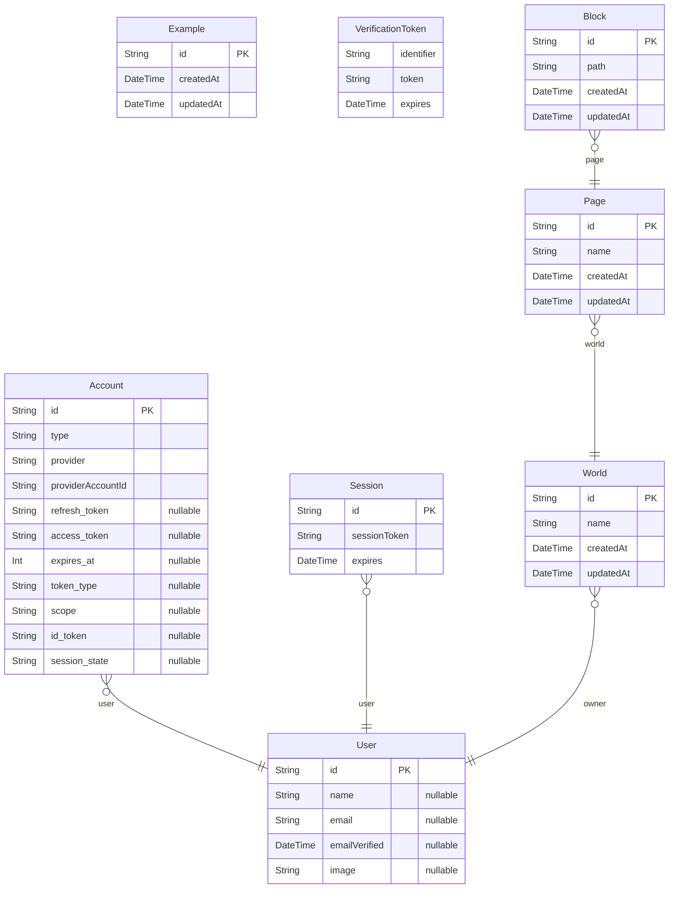

```mermaid
erDiagram

  Example {
    String id PK
    DateTime createdAt
    DateTime updatedAt
    }


  Account {
    String id PK
    String type
    String provider
    String providerAccountId
    String refresh_token  "nullable"
    String access_token  "nullable"
    Int expires_at  "nullable"
    String token_type  "nullable"
    String scope  "nullable"
    String id_token  "nullable"
    String session_state  "nullable"
    }


  Session {
    String id PK
    String sessionToken
    DateTime expires
    }


  User {
    String id PK
    String name  "nullable"
    String email  "nullable"
    DateTime emailVerified  "nullable"
    String image  "nullable"
    }


  VerificationToken {
    String identifier
    String token
    DateTime expires
    }


  World {
    String id PK
    String name
    DateTime createdAt
    DateTime updatedAt
    }


  Page {
    String id PK
    String name
    DateTime createdAt
    DateTime updatedAt
    }


  Block {
    String id PK
    String path
    DateTime createdAt
    DateTime updatedAt
    }

    Account o{--|| User : "user"
    Session o{--|| User : "user"
    World o{--|| User : "owner"
    Page o{--|| World : "world"
    Block o{--|| Page : "page"
```
